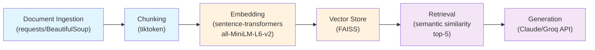

# Project 1 Planning: The Unofficial Guide

> Write this document before you write any pipeline code.
> Your spec and architecture diagram are what you'll use to direct AI tools (Claude, Copilot, etc.) to generate your implementation — the more specific they are, the more useful the generated code will be.
> Update the Retrieval Approach and Chunking Strategy sections if you change your approach during implementation.
> Update this file before starting any stretch features.

---

## Domain

Student-generated course and professor review knowledge for UC Berkeley Computer Science classes. Official course catalogs and department pages describe what is taught, but not how individual instructors grade, whether they provide useful feedback, or which professors make a class worth the workload. This system will surface the lived experience students share on Reddit and informal advice threads.

---

## Documents

| # | Source | Description | URL or location |
|---|--------|-------------|-----------------|
| 1 | CS profs on reddit | Student thread comparing Berkeley CS professors | https://www.reddit.com/r/berkeley/comments/fa120e/cs_profs_on_reddit/ |
| 2 | Best/worst STEM professors? | Student list of strong and weak STEM instructors | https://www.reddit.com/r/berkeley/comments/1k5ncfq/bestworst_stem_professors/ |
| 3 | Why I Quit CS | Thread describing why students left CS | https://www.reddit.com/r/berkeley/comments/rrn14k/why_i_quit_cs/ |
| 4 | The difference between this professor and that one CS 189 professor ?? | Detailed comparisons of two CS instructors | https://www.reddit.com/r/berkeley/comments/1ct2pq6/the_difference_between_this_professor_and_that/ |
| 5 | CS Major Advice | Advice about course sequencing, professors, and major planning | https://www.reddit.com/r/berkeley/comments/1s6iarl/cs_major_advice/ |
| 6 | my opinion on cs classes | Student opinions on individual CS course experiences | https://www.reddit.com/r/berkeley/comments/1btbpq5/my_opinion_on_cs_classes/ |
| 7 | Best Professors | Students naming the most helpful professors | https://www.reddit.com/r/berkeley/comments/tzjiou/best_professors/ |
| 8 | Must-take CS upper divs? | Student recommendations for upper-division CS courses | https://www.reddit.com/r/berkeley/comments/122ea3o/musttake_cs_upper_divs/ |
| 9 | Cool Professors to Talk To | Students recommending approachable research professors | https://www.reddit.com/r/berkeley/comments/1ieu3ha/cool_professors_to_talk_to/ |
| 10 | Who are the best Engineering Professors to take? What classes did they teach? | Broader student ranking of engineering instructors | https://www.reddit.com/r/berkeley/comments/c0yo6t/who_are_the_best_engineering_professors_to_take/ |

---

## Chunking Strategy

**Approach:** Comment-based chunking with size constraints

**Strategy:**
- Main post text: Split into chunks if exceeds 2000 characters (by paragraph boundary)
- Each top-level Reddit comment: Treated as one chunk (preserves complete review/opinion)
- Long comments (>2000 characters): Split by paragraph or sentence boundary, not mid-thought
- No fixed overlap; chunk boundaries respect Reddit's natural comment structure

**Reasoning:**
Reddit professor reviews are organized as discrete student opinions. Each comment is typically one cohesive thought about a professor or course. Fixed token-size chunking risks splitting a recommendation across boundaries, losing context. Comment-based chunking respects Reddit's structure, makes retrieval results more interpretable (each chunk is a complete opinion), and simplifies source attribution (each comment is one source unit). Chunk sizes will be naturally uneven (50–2000 tokens), which FAISS handles without issue.

---

## Retrieval Approach

**Embedding model:** sentence-transformers/all-MiniLM-L6-v2

**Top-k:** 5

**Production tradeoff reflection:**
For this student-review corpus, a lightweight semantic embedding model is a good starting point because it balances speed, cost, and relevance for short opinion text. In production, I would weigh larger or domain-tuned embeddings for better nuance on professor/course names, while also considering whether a hosted API is acceptable for privacy and latency. 

---

## Evaluation Plan

| # | Question | Expected answer |
|---|----------|-----------------|
| 1 | Which upper-division CS courses are mentioned as must-takes in the "Must-take CS upper divs?" thread? Name at least two. | The thread explicitly recommends CS 170, CS 189, CS 164, and/or other specific upper-division courses by number. |
| 2 | List at least two specific reasons students cite in "Why I Quit CS" for leaving the major. | The thread mentions: burnout/overwork, harsh grading, difficult professors, lack of support, imposter syndrome, or mental health struggles. |
| 3 | What three qualities do students in "Best Professors" use to describe excellent CS professors? | Students cite: clear/engaging lectures, helpful/available office hours, fair/transparent grading, good feedback, or accessibility. |
| 4 | Name at least one specific professor mentioned in "Cool Professors to Talk To" as approachable. | The thread names a specific professor by name (e.g., "Professor [X]" or "Dr. [Y]") and describes them as supportive, accessible, or research-engaged. |
| 5 | What specific consequence of taking a difficult CS professor in an intro class is mentioned in the threads? | Students warn: harder exams, higher stress, lower grades, difficulty learning fundamentals, or need for more outside help. |

---

## Anticipated Challenges

1. Reddit threads contain a lot of noise, off-topic replies, and quote text; preprocessing must remove navigation and keep only substantive student opinions.

2. Parsing Reddit's HTML or JSON structure correctly to extract comments without losing metadata (author, timestamp) needed for source attribution. Also, very long comments (>2000 chars) need intelligent paragraph-boundary splitting to avoid orphaned thoughts.

---

## Architecture

**Pipeline stages:**
- **Document Ingestion:** Fetch Reddit thread HTML, parse thread text, extract main post + comments, strip navigation/metadata
- **Chunking:** Split by Reddit comment boundaries; cap long comments at 2000 characters using paragraph breaks
- **Embedding:** Convert chunks to vectors using all-MiniLM-L6-v2
- **Vector Store:** Index embeddings in FAISS for fast similarity search
- **Retrieval:** Semantic similarity search, return top-5 relevant chunks
- **Generation:** Prompt LLM with retrieved chunks, enforce grounding, add source citations

---

## AI Tool Plan

**Milestone 3 — Ingestion and chunking:**
I will use Claude Code to implement `load_documents()` and `chunk_text()` from this planning spec. I will give the model the Documents list and Chunking Strategy sections and verify the output by inspecting cleaned text and chunk lengths.

**Milestone 4 — Embedding and retrieval:**
I will prompt Claude Code with the Retrieval Approach and the vector store design. The output should be a working embedding pipeline plus a `query()` function. I will verify it by running search queries and checking that the retrieved chunks match expected thread topics.

**Milestone 5 — Generation and interface:**
I will use Claude Code to design the grounding prompt and a simple command-line or notebook query wrapper. I will verify by asking sample questions and confirming that the answer cites the source URLs or chunk IDs.
