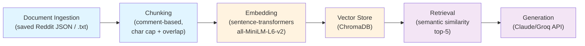

# Project 1 Planning: The Unofficial Guide

> Write this document before you write any pipeline code.
> Your spec and architecture diagram are what you'll use to direct AI tools (Claude, Copilot, etc.) to generate your implementation — the more specific they are, the more useful the generated code will be.
> Update the Retrieval Approach and Chunking Strategy sections if you change your approach during implementation.
> Update this file before starting any stretch features.

---

## Domain

Student-generated course and professor review knowledge for UC Berkeley Computer Science classes. Official course catalogs and department pages describe what is taught, but not how individual instructors grade, whether they provide useful feedback, or which professors make a class worth the workload. This system will surface the lived experience students share on Reddit and informal advice threads.

---

## Documents

| # | Source | Description | URL or location |
|---|--------|-------------|-----------------|
| 1 | CS profs on reddit | Student thread comparing Berkeley CS professors | https://www.reddit.com/r/berkeley/comments/fa120e/cs_profs_on_reddit/ |
| 2 | Best/worst STEM professors? | Student list of strong and weak STEM instructors | https://www.reddit.com/r/berkeley/comments/1k5ncfq/bestworst_stem_professors/ |
| 3 | Why I Quit CS | Thread describing why students left CS | https://www.reddit.com/r/berkeley/comments/rrn14k/why_i_quit_cs/ |
| 4 | The difference between this professor and that one CS 189 professor ?? | Detailed comparisons of two CS instructors | https://www.reddit.com/r/berkeley/comments/1ct2pq6/the_difference_between_this_professor_and_that/ |
| 5 | CS Major Advice | Advice about course sequencing, professors, and major planning | https://www.reddit.com/r/berkeley/comments/1s6iarl/cs_major_advice/ |
| 6 | my opinion on cs classes | Student opinions on individual CS course experiences | https://www.reddit.com/r/berkeley/comments/1btbpq5/my_opinion_on_cs_classes/ |
| 7 | Best Professors | Students naming the most helpful professors | https://www.reddit.com/r/berkeley/comments/tzjiou/best_professors/ |
| 8 | Must-take CS upper divs? | Student recommendations for upper-division CS courses | https://www.reddit.com/r/berkeley/comments/122ea3o/musttake_cs_upper_divs/ |
| 9 | Cool Professors to Talk To | Students recommending approachable research professors | https://www.reddit.com/r/berkeley/comments/1ieu3ha/cool_professors_to_talk_to/ |
| 10 | Who are the best Engineering Professors to take? What classes did they teach? | Broader student ranking of engineering instructors | https://www.reddit.com/r/berkeley/comments/c0yo6t/who_are_the_best_engineering_professors_to_take/ |

---

## Chunking Strategy

**Approach:** Comment-based chunking with an embedding-aware size cap and overlap

**Strategy:**
- Each Reddit comment (and reply) is treated as one chunk, preserving a complete review/opinion as its own retrievable unit.
- Cleaning before chunking: unescape HTML entities, normalize whitespace, and drop `[deleted]`/`[removed]` text, bot comments (AutoModerator, etc.), stickied moderator comments, and anything shorter than 30 characters (one-word noise like "lol", "+1").
- **Size cap: 800 characters.** Any post body or comment longer than this is split on paragraph boundaries first, then sentence boundaries, then (last resort) a hard character cut — never mid-word.
- **Overlap: ~120 characters (≈1 sentence)** carried from the end of one piece into the start of the next, but **only between pieces of the same split item.** Standalone comments have no overlap.
- **Context enrichment (not embedded):** each comment chunk also stores the thread title + original post (the question/topic) in a separate `context` field. This is *not* part of the embedded text — it is attached so the generation step can interpret a terse chunk (e.g. "Sharma being the goat") against the question it answered.

**Reasoning:**
Reddit professor reviews are organized as discrete student opinions, so comment-based chunking respects that structure, keeps each chunk interpretable (one complete opinion), and makes source attribution clean (each chunk maps to one comment).

The 800-character cap is tuned to the embedding model: `all-MiniLM-L6-v2` only encodes its first **256 tokens (~1,000 characters)**, so anything longer is silently truncated and becomes unsearchable. My original 2,000-character cap left **13 long posts/reviews (8% of the corpus) with their tails dropped at embedding time**; the 800-char cap (effective max ~921 chars with overlap) keeps every chunk fully inside the model's window.

The ~120-character overlap is a deliberate change from my original "no overlap" plan: when a long review is split into 2–3 pieces, an argument can break across a boundary, so carrying one sentence of context preserves continuity. It is limited to pieces of a single split item so short standalone comments are never bloated.

The separate `context` field avoids two failure modes that would come from stuffing the post body into every chunk's embedded text: (1) truncation, since a long prefix would push the comment itself past the 256-token limit, and (2) homogenization, where a shared prefix pulls all of a thread's chunks toward the same vector and makes "I love Sahai" hard to distinguish from "avoid Sahai."

**Final chunk count:** 185 chunks across 10 documents (lengths 30–921 characters), up from 160 under the original 2,000-character cap. ChromaDB handles the uneven sizes without issue.

---

## Retrieval Approach

**Embedding model:** sentence-transformers/all-MiniLM-L6-v2

**Top-k:** 5

**Production tradeoff reflection:**
For this student-review corpus, a lightweight semantic embedding model is a good starting point because it balances speed, cost, and relevance for short opinion text. In production, I would weigh larger or domain-tuned embeddings for better nuance on professor/course names, while also considering whether a hosted API is acceptable for privacy and latency. 

---

## Evaluation Plan

| # | Question | Expected answer |
|---|----------|-----------------|
| 1 | Which upper-division CS courses are mentioned as must-takes in the "Must-take CS upper divs?" thread? Name at least two. | The thread explicitly recommends CS 170, CS 189, CS 164, and/or other specific upper-division courses by number. |
| 2 | List at least two specific reasons students cite in "Why I Quit CS" for leaving the major. | The thread mentions: burnout/overwork, harsh grading, difficult professors, lack of support, imposter syndrome, or mental health struggles. |
| 3 | What three qualities do students in "Best Professors" use to describe excellent CS professors? | Students cite: clear/engaging lectures, helpful/available office hours, fair/transparent grading, good feedback, or accessibility. |
| 4 | Name at least one specific professor mentioned in "Cool Professors to Talk To" as approachable. | The thread names a specific professor by name (e.g., "Professor [X]" or "Dr. [Y]") and describes them as supportive, accessible, or research-engaged. |
| 5 | What specific consequence of taking a difficult CS professor in an intro class is mentioned in the threads? | Students warn: harder exams, higher stress, lower grades, difficulty learning fundamentals, or need for more outside help. |

---

## Anticipated Challenges

1. Reddit threads contain a lot of noise, off-topic replies, and quote text; preprocessing must remove navigation and keep only substantive student opinions.

2. Parsing Reddit's HTML or JSON structure correctly to extract comments without losing metadata (author, timestamp) needed for source attribution. Also, very long comments (>2000 chars) need intelligent paragraph-boundary splitting to avoid orphaned thoughts.

---

## Architecture

**Pipeline stages:**
- **Document Ingestion:** Load each thread from a locally saved Reddit `.json` export (or a `.txt` copy), parse the post + comments, and clean them (unescape HTML, drop deleted/removed/bot/short comments). Live web fetching is out of scope: Reddit blocks unauthenticated requests (HTTP 403) and the only working route is the OAuth API, which adds credentials and a dependency we don't need.
- **Chunking:** Split by Reddit comment boundaries; cap posts/comments at 800 characters (tuned to the embedding model's ~1,000-char window) using paragraph → sentence breaks, with ~120-char overlap between pieces of one split item.
- **Embedding:** Convert chunks to vectors using all-MiniLM-L6-v2
- **Vector Store:** Index embeddings in ChromaDB (persistent, cosine distance) with source metadata for fast similarity search and attribution
- **Retrieval:** Semantic similarity search, return top-5 relevant chunks
- **Generation:** Prompt LLM with retrieved chunks, enforce grounding, add source citations

---

## AI Tool Plan

**Milestone 3 — Ingestion and chunking:**
I will use Claude Code to implement `load_documents()` and `chunk_text()` from this planning spec. I will give the model the Documents list and Chunking Strategy sections and verify the output by inspecting cleaned text and chunk lengths.

**Milestone 4 — Embedding and retrieval:**
I will prompt Claude Code with the Retrieval Approach and the vector store design. The output should be a working embedding pipeline plus a `query()` function. I will verify it by running search queries and checking that the retrieved chunks match expected thread topics.

**Milestone 5 — Generation and interface:**
I will use Claude Code to design the grounding prompt and a simple command-line or notebook query wrapper. I will verify by asking sample questions and confirming that the answer cites the source URLs or chunk IDs.
